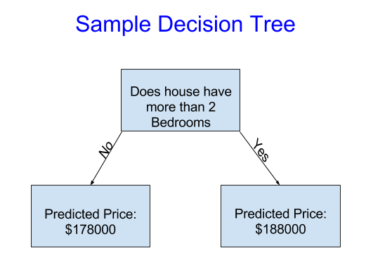

### INTRODUCTION
#
> - This may feel basic if you've done statistical modeling or machine learning before.

> - This course will have you build models as you go through following scenario:

```plaintext
Your cousin has made millions of dollars speculating on real estate. He's offered to
become business partners with you because of your interest in data science. He'll
supply the money, and you'll supply models that predict how much various houses are
worth.

You ask your cousin how he's predicted real estate values in the past, and he says
it is just intuition. But more questioning reveals that he's identified price
patterns from houses he has seen in the past, and he uses those patterns to make
predictions for new houses he is considering.
```

> - Machine learning works the same way.

> - We'll start with a model called the `Decision Tree`.

> - `Decision Tree` are fancier models that give more accurate predictions.

> - But decision trees are easy to understand, and they are the building block for
    some of the best models in data science.



<br />

```plaintext
The example above divides houses into only two categories. The predicted price for
any house under consideration is the historical average price of houses in the same
category.
```

> - We use data to decide how to break the houses into two groups, and then again
    to determine the predicted price in each group.

> - `Fitting` or `training the model` is the step of capturing patterns from data.

> - `Training data` is the data used to fit the model.
