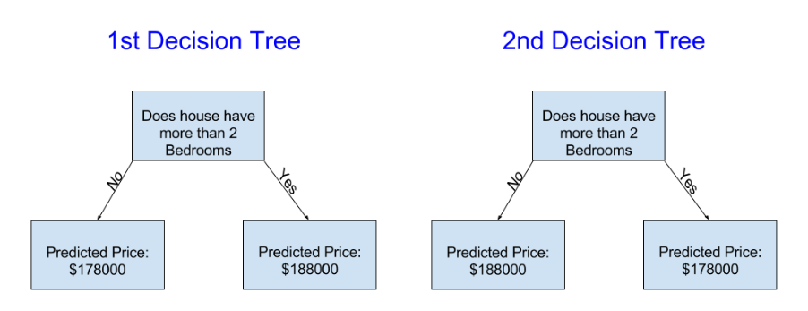
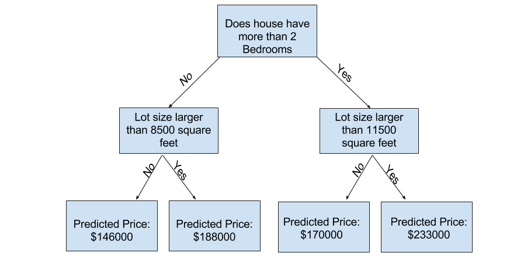

### IMPROVING THE DECISION TREE
##
> - Which of the following two decision trees is more likely to result from fitting the
    real estate training data?



<br />

```plaintext
The Decision Tree 1 probably makes more sense, because it captures the reality that
houses with more bedrooms tend to sell at higher prices than houses with fewer bedrooms.
The biggest shortcoming of this model is that it doesn't capture most factors affecting
home price, like number of bathrooms, lot size, location, etc.
```

> - You can capture more factors using a tree that has more "splits" which are called
    `Deeper Trees`.

> - A decision tree that also considers the total size of each house's lot might look
    like below:



<br />

```plaintext
You predict the price of any house by tracing through the decision tree, always picking
the path corresponding to that house's characteristics. The predicted price for the
house is at the bottom of the tree.
```

> - `Leaf` is the point at the bottom where we make a prediction.

> - The splits and values at the leaves will be determined by the data.
