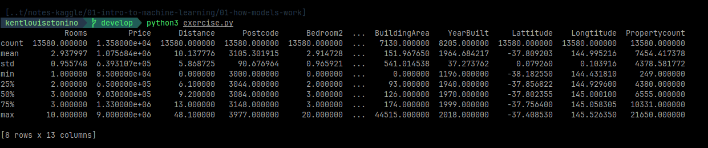

### USING PANDA
#
> - `Pandas` is a library use for exploring and manipulating data.

> - `DataFrame` holds the type of data you might think of as a table.

> - To execute the exercise program.

```python
python3 exercise.py
```

<br />
<br />


### INTERPRETING DATA DESCRIPTION
#


<br />

```plaintext
count
    - Shows how many rows have non-missing values.
    - For example, the size of 2nd bedroom wouldn't be collected when surveying a 1 bedroom house.

mean
    - The average.

std
    - Is the standard deviation, which measures how numerically spread out the values are.

min
    - The smallest value.

25%
    - The 25th percentile.

50%
    - The 50th percentile.

75%
    - The 75th percentile.

max
    - The largest number.
```
