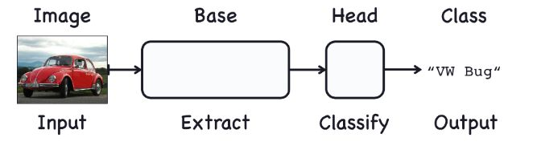
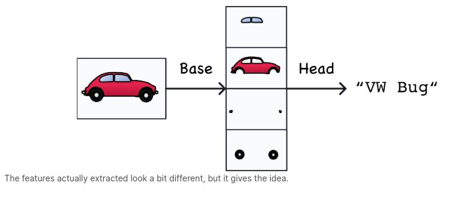

### Two Parts of Convnet Image Classification

> - `(1) Convolutional base` is used to extract the features from an image. It
    is formed primarily of layers performing the convolution operation, but often
    includes other kinds of layers as well.

> - `(2) Dense head` is used to determine the class of the image. It is formed
    of dense layers, but might include other layers like dropout.

 
 

### Feature or Visual Feature
> - A `feature` could be a line, a color, a texture, a shape, a pattern - or some
    complicated combination.

> - The whole process are somewhat the same below.

