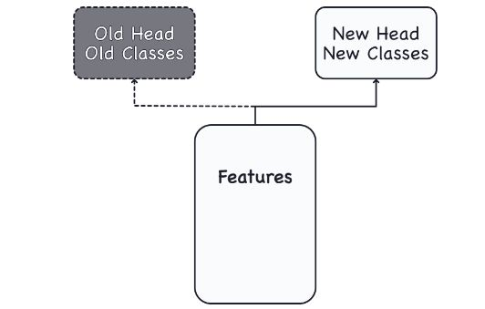

### Goal of the Network during Training is to Learn Two Things
> - `(1) Which features to extract from an image (base)`.

> - `(2) Which class goes with what features (head)`.

 
 

### Training the Classifier
> - These days, `convnets` are rarely trained from scratch. More often, we
    `reused the base of a pretrained model`. To the pretrained based we then
    `attach an untrained head`. In other words, we reuse the part of a network
    that has already learned to do `(1) Extract features`, and attach to it
    some fresh layers to learn `(2) Classify`.

> - Because the head usually consists of only a few dense layers, very
    accurate classifiers can be created from relatively little data.

 
 

### Transfer Learning
> - It is a techinique of reusing a pretrained model.

> - It is so effective, that almost every image classifier these days will
    make use of it.

